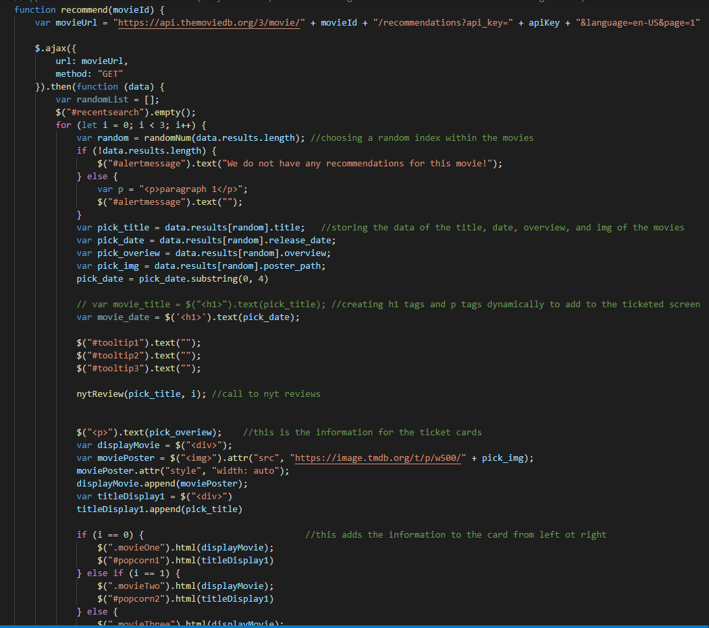

# Grab your popcorn!

**What our website does**

Upon landing on the page, our website shows three trending movies this week in America, and dynamically updates based on the API Call. If next week there are three different trending movies, it will automatically replace those previous movies with the new trending ones.

This application also generates three possible movies that are similar to the one you have searched. For instance, if you searched Marvel’s The Avengers, it might return other Marvel related movies you might like such as Spiderman or Thor.

Our motivation to building this application was to make movie night easier for everyone, with our application it simplifies that process, by taking movies you have already watched and enjoyed and displaying three possible choices that fill your criteria. Whether from there you flip a coin and decide that way, or you can read the NY Times summary we have provided via the NY Times Movie Reviews API to see if that movie suits you.

 

## Built With

* [HTML](https://developer.mozilla.org/en-US/docs/Web/HTML)
* [CSS](https://developer.mozilla.org/en-US/docs/Web/CSS)
* [Javascript](https://developer.mozilla.org/en-US/docs/Web/JavaScript)
* [JQuery](https://jquery.com/)
* [Tailwind CSS](https://tailwindcss.com/)
* [The Movie Database API](https://developers.themoviedb.org/3)
* [NY Times API](https://developer.nytimes.com/docs/movie-reviews-api/1/overview)

## Deployed Link

* [Solve your movie indecisiveness](https://alix1713.github.io/tvremote/)

## Authors

* **Alix Friedman** 
* **Daniel Vo** 
* **Derek Banister** 

## Our LinkedIn's and Github's

- [Alix's LinkedIn](https://www.linkedin.com/in/alix1713/)
- [Daniel's LinkedIn](https://www.linkedin.com/daniel-vo-57b00521b)
- [Derek's LinkedIn](https://www.linkedin.com/in/derek-banister/)

- [Alix's GitHub](https://github.com/Alix1713)
- [Daniel's GitHub](https://github.com/danielvo1)
- [Derek's Github](https://github.com/DerekBanister)

## Acknowledgments

* 
* 
* 